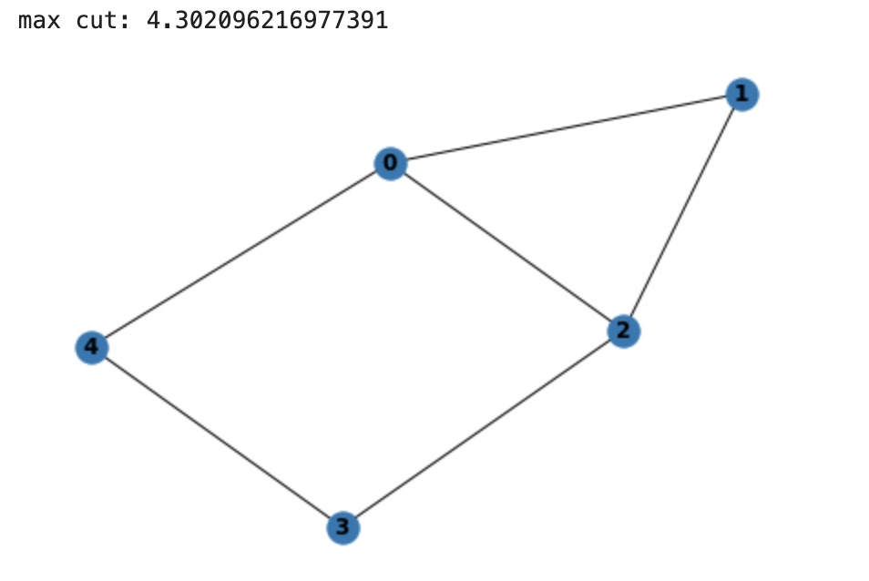

# MindSpore-Noise
# Quantum Channels
When performing computations on a quantum computer, the states of quantum bits (qubits) can be disturbed due to environmental uncertainties and errors. Common noise models include Pauli channels, bit-flip channels, phase-flip channels, and amplitude damping channels. This GitHub repository implements the aforementioned noise models to better understand and handle errors in quantum computation.

## Pauli Channel

The Pauli channel is a channel that randomly applies $X$, $Y$, or $Z$ gates on qubits, or does nothing. Three parameters, $P_x$, $P_y$, and $P_z$, control the probabilities of applying each gate, where $P = 1 - P_x - P_y - P_z$ represents the probability of doing nothing. The noise applied by this channel can be expressed as:

$$\varepsilon(\rho) = (1 - P_x - P_y - P_z) \rho + P_x X \rho X + P_y Y \rho Y + P_z Z \rho Z,$$

where $\rho$ is the quantum state represented by the density matrix, and $P_x$, $P_y$, and $P_z$ are the probabilities of applying $X$, $Y$, and $Z$ gates, respectively.

For example, consider a quantum circuit where a qubit has a 10% probability of being subjected to an additional $X$, $Y$, or $Z$ gate through a Pauli channel, as shown in the following figure:
<!--  -->

Now let's simulate this circuit 10,000 times and output the sampling results:

In the absence of noise, the quantum state should be in the state |1⟩, and all measurement results should be 1. However, in the above results, about 20% of the simulated results are measured as 0, which is the effect of Pauli channel noise.

## Bit-Flip Channel
The bit-flip channel is a channel that randomly flips the state of a qubit from 0 to 1 or from 1 to 0. It uses a parameter $p$ to control the probability of flipping the bit. The noise applied by this channel can be expressed as:

$$\varepsilon(\rho) = (1 - p) \rho + p X \rho X$$

For example, consider a quantum circuit where a qubit has a 10% probability of being subjected to an additional $X$ gate through a bit-flip channel, as shown in the following figure:

Now let's simulate this circuit 10,000 times and output the sampling results:

In the above results, about 10% of the simulated results are measured as 0.

## Phase-Flip Channel
The phase-flip channel is a channel that randomly flips the phase of a qubit from 0 to π or from π to 0. It uses a parameter $p$ to control the probability of flipping the phase. The noise applied by this channel can be expressed as:

$$\varepsilon(\rho) = (1 - p) \rho + p Z \rho Z$$

For example, consider a quantum circuit where a qubit has a 10% probability of being subjected to an additional $Z$ gate through a phase-flip channel, as shown in the following figure:

Now let's simulate this circuit 10,000 times and output the sampling results:

## Amplitude Damping Channel
The amplitude damping channel is a commonly encountered channel that describes the dissipation of energy in a quantum system. The amplitude damping channel causes a qubit to decay from an excited state to a ground state. The expression for the amplitude damping channel is:

$$\varepsilon_{AD}(\rho) = E_0 \rho E_0^{\dagger} + E_1 \rho E_1^{\dagger}$$

For example, consider a quantum circuit where a qubit has a 10% probability of being subjected to an additional $X$ gate through an amplitude damping channel, as shown in the following figure:

Now let's evolve this circuit multiple times and output the sampling results:

It can be seen that the energy of the qubit dissipates after passing through the amplitude damping channel.

Related demonstration code can be found in the "examples" folder.

# Use Cases
## Optimization
The Quantum Approximate Optimization Algorithm (QAOA) is a quantum algorithm proposed by Farhi et al. in 2014 that uses quantum computers to approximate solutions to combinatorial optimization problems. Applying the QAOA algorithm to solve the Max-Cut problem and introducing quantum noise, the results are as follows:

The correct answer is 5, but with the introduction of noise, the result becomes 4.3, indicating that noise introduces some interference.

## Quantum Phase Estimation
The Quantum Phase Estimation (QPE) algorithm is a key component of many quantum algorithms. Assuming a unitary operator $U$ acting on its eigenstate $|u\rangle$ produces a phase $e^{2 \pi i \varphi}$, the goal of the QPE algorithm is to estimate this phase $\varphi$. We introduce phase-flip errors in the QPE algorithm, specifically, phase-flip noise on the first qubit, as shown in the following figure:

The estimated result is as follows:

The correct result is 0.125, but noise introduces some interference.

The specific related code can be found in the "project" folder.

# References
1.Nielsen M A, Chuang I. Quantum computation and quantum information[J]. 2002.  
2.Wang H, Ding Y, Gu J, et al. Quantumnas: Noise-adaptive search for robust quantum circuits[C]//2022 IEEE International Symposium on High-Performance Computer Architecture (HPCA). IEEE, 2022: 692-708.  
3.Nachman B, Urbanek M, de Jong W A, et al. Unfolding quantum computer readout noise[J]. npj Quantum Information, 2020, 6(1): 84.

